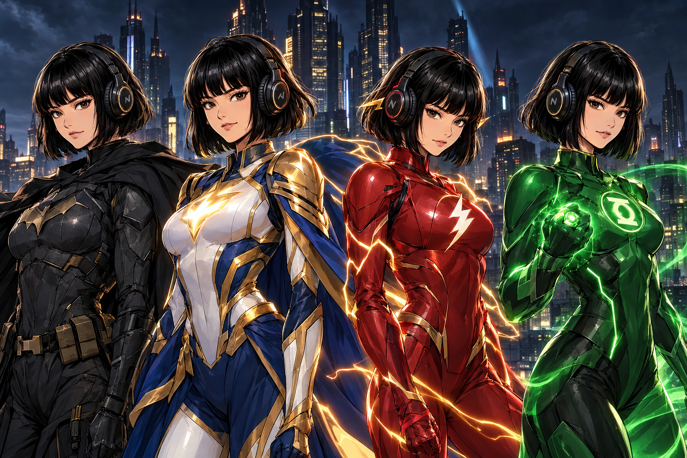

# Hermes DC Profiles



A collection of installable Hermes Agent personas inspired by the **DC
Universe** (famous + most-popular characters).

Each persona is a separate Hermes [profile
distribution](https://hermes-agent.nousresearch.com/docs/user-guide/profile-distributions).
It changes how Hermes reasons, communicates, disagrees, handles pressure, and
collaborates. It does **not** turn Hermes into a shallow quote generator or
remove its normal tools and factual standards.

> **Unofficial, non-commercial fan work.** Not affiliated with or endorsed by
> Warner Bros. Discovery. See [RIGHTS.md](./RIGHTS.md).

## What each profile contains

- A substantial `SOUL.md` (identity, voice, worldview, operating method,
  strengths, blind spots, pressure behavior, disagreement style, safeguards,
  task affinities)
- A character-branded terminal skin
- A provider-neutral `config.yaml`
- A standard `distribution.yaml`

No profile ships credentials, memories, session history, a model choice, cron
jobs, or MCP servers. Your provider setup stays yours.

## Roster (36 profiles across 6 families)

**The Justice League (9):** batman** superman** wonder woman** the flash** martian manhunter** green lantern hal** aquaman** cyborg** shazam
**Metropolis (3):** supergirl** lois lane** steel john henry
**The Bat-Family (7):** nightwing** robin damian** batgirl oracle** alfred** red hood the red team** batwoman** catwoman
**Street Level (6):** green arrow** black canary** john constantine** zantanna** the question** huntress
**Cosmic & Magical (3):** starfire** raven** blue beetle
**The Rogue's Gallery / red-team (8):** joker the red team** lex luthor the red team** reverse flash the red team** brainiac the red team** ras al ghul the red team** scarecrow the red team** two face the red team** darkseid the red team

## Browse

```bash
python3 tools/fabricate.py --no-build    # validate source
python3 tools/fabricate.py               # regenerate profiles/ + catalog.json
python3 tools/verify.py                  # structural sanity + banned-token gate
```

The generated catalog lives in [`catalog.json`](./catalog.json); the roster in
[`ROSTER.md`](./ROSTER.md).

## Install

```bash
git clone https://github.com/JPeetz/hermes-dc-profiles.git
cd hermes-dc-profiles
hermes profile install ./profiles/<slug>
```

Start: `<slug> chat` or `hermes -p <slug> chat`.

## Design principles

1. **Behavior over cosplay.** A persona changes how the agent approaches work.
2. **Useful asymmetry.** Two personas solve the same problem differently.
3. **Character limits survive.** Blind spots modeled, then bounded.
4. **User agency stays intact.** No in-universe rank imposed on the user.
5. **Original wording only.** No scripts, dialogue, art, logos, catchphrases.
6. **Provider neutral.** No model or API-key assumptions.

## Development

Persona source lives in `source/dc.json` (21-key schema). Generated
distributions are deterministic (`tools/fabricate.py`).

## Rights & attribution

Unofficial fan work. DC characters belong to Warner Bros. Discovery. Full
statement in [RIGHTS.md](./RIGHTS.md). The profile-distribution pattern is
inspired by
[teknium1/hermes-star-trek-profiles](https://github.com/teknium1/hermes-star-trek-profiles).

---

### ☕ Support this work
If these profiles save you time or make your agents more enjoyable, consider
buying me a coffee:

<a href="https://www.buymeacoffee.com/joerg_peetz"></a>

**Stay building. — JPeetz**
